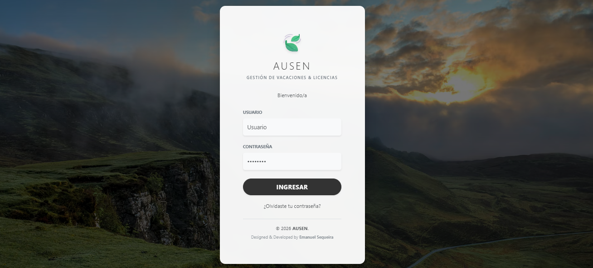

<div align="center">

# 🍃 AUSEN
### Sistema de Gestión de Vacaciones y Licencias

**🌐 Web Oficial:** [www.ausen.com.ar](https://www.ausen.com.ar)

---


<br>


</div>

---

## 📋 Descripción

**AUSEN** es una solución integral desarrollada para optimizar la gestión de recursos humanos en cooperativas y PyMES. El sistema digitaliza el proceso de solicitud, aprobación y seguimiento de vacaciones y licencias, reemplazando las planillas manuales por una interfaz web intuitiva y automatizada.

El objetivo principal es brindar transparencia a los empleados sobre sus días disponibles y facilitar a la administración el control del ausentismo mediante métricas en tiempo real.

## ✨ Características Principales

* **📊 Dashboard Interactivo:** Visualización de métricas clave (ausentismo mensual, distribución diaria, empleados activos) para la toma de decisiones.
* **🧮 Cálculo Automático (LCT):** Algoritmo inteligente que calcula los días de vacaciones correspondientes según la antigüedad del empleado (basado en la Ley de Contrato de Trabajo Argentina).
* **👥 Gestión de Empleados:** Sistema completo de administración de perfiles (ABM) con historial laboral y datos personales.
* **📩 Notificaciones Automáticas:** Envío de correos electrónicos a RRHH y supervisores cada vez que se genera o aprueba una solicitud.
* **📄 Reportes PDF:** Generación instantánea de reportes de saldos y solicitudes listos para imprimir y firmar.
* **🔐 Seguridad:** Sistema de autenticación robusto con diferenciación de roles (Administrador vs. Usuario estándar).

---

## 📸 Tour del Sistema

### Flujo de Solicitudes
| Formulario de Solicitud | Opciones de Licencia |
| :---: | :---: |
|  |  |

### Gestión Administrativa
| Nómina de Empleados | Gestión de Usuarios (Roles) |
| :---: | :---: |
|  |  |

### Legajo Digital
| Detalle de Empleado (Perfil) | Historial y Documentación |
| :---: | :---: |
|  |  |

### Visualización y Acceso (Dark Mode)
| Calendario de Ausencias | Panel Métricas Oscuro |
| :---: | :---: |
|  |  |

<div align="center">
  
  <p><i>Pantalla de Acceso Seguro</i></p>
</div>

---

## 🛠️ Stack Tecnológico

* **Backend:** Python, Django Framework.
* **Base de Datos:** SQLite (Entorno Local) / MySQL (Producción).
* **Frontend:** HTML5, CSS3, Bootstrap 5, JavaScript.
* **Gráficos:** Chart.js.
* **Despliegue:** PythonAnywhere (Gunicorn + WhiteNoise).
* **Control de Versiones:** Git & GitHub.

## 🚀 Instalación y Despliegue Local

Si deseas correr este proyecto en tu entorno local, sigue estos pasos:

1. **Clonar el repositorio**
   ```bash
   git clone https://github.com/Manuseq94/AUSEN.git
   cd AUSEN

2. **Crear y activar entorno virtual**
   ```bash
   python -m venv venv
# En Windows:
    venv\Scripts\activate
# En Linux/Mac:
    source venv/bin/activate

3. **Instalar dependencias**
   ```bash
   pip install -r requirements.txt

4. **Configurar variables de entorno**
   Crea un archivo `.env` en la raíz del proyecto (puedes copiar el `.env.example`) y configura tus claves:
   ```env
   SECRET_KEY=tu_clave_secreta_aqui
   DEBUG=True
   EMAIL_HOST_PASSWORD=tu_clave_app_gmail

5. **Migrar base de datos y correr servidor**
   ```bash
   python manage.py migrate
   python manage.py runserver


## 👤 Autor

**Emanuel Sequeira**
* Full Stack Developer
* [GitHub Perfil](https://github.com/Manuseq94)

---
<div align="center">
  <sub>Desarrollado con ❤️ para la gestión eficiente de equipos.</sub>
</div>
